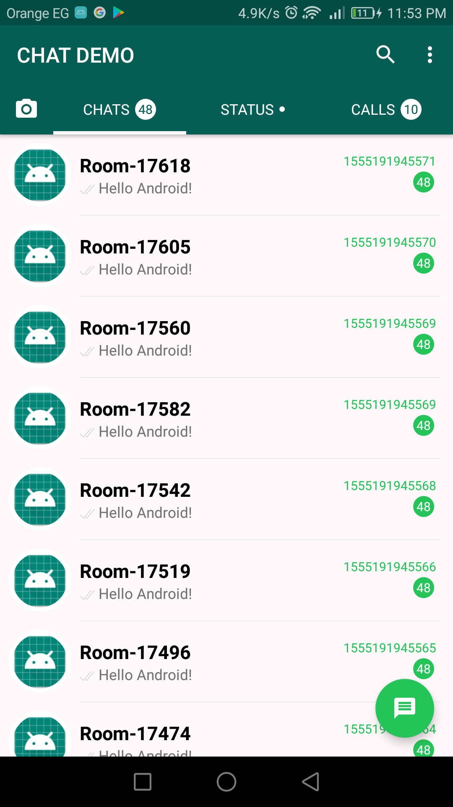

# whatsApp

an android app the a copy of whats app layout and it is a demo of how how can create database using room and create relation between tables and another arch.c like mvvm and live data.

 

